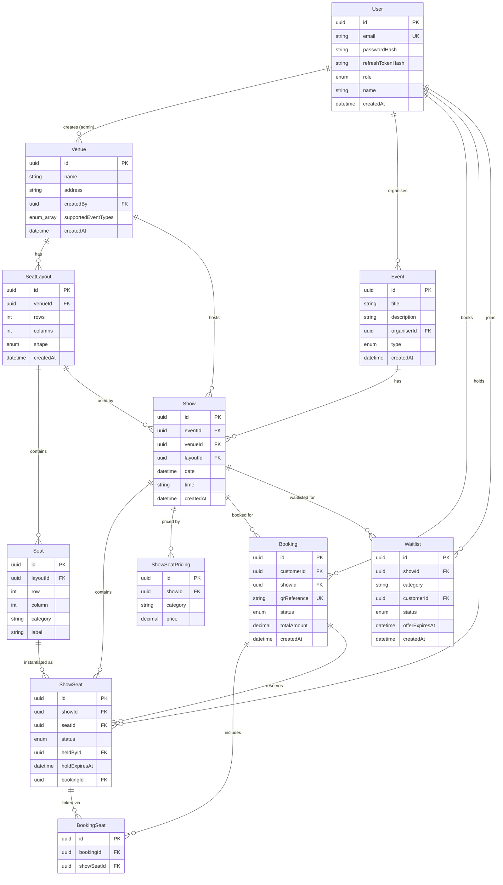

# ER Diagram

```mermaid
erDiagram
    User {
        uuid id PK
        string email UK
        string passwordHash
        string refreshTokenHash
        enum role
        string name
        datetime createdAt
    }

    Venue {
        uuid id PK
        string name
        string address
        uuid createdBy FK
        enum_array supportedEventTypes
        datetime createdAt
    }

    SeatLayout {
        uuid id PK
        uuid venueId FK
        int rows
        int columns
        enum shape
        datetime createdAt
    }

    Seat {
        uuid id PK
        uuid layoutId FK
        int row
        int column
        string category
        string label
    }

    Event {
        uuid id PK
        string title
        string description
        uuid organiserId FK
        enum type
        datetime createdAt
    }

    Show {
        uuid id PK
        uuid eventId FK
        uuid venueId FK
        uuid layoutId FK
        datetime date
        string time
        datetime createdAt
    }

    ShowSeatPricing {
        uuid id PK
        uuid showId FK
        string category
        decimal price
    }

    ShowSeat {
        uuid id PK
        uuid showId FK
        uuid seatId FK
        enum status
        uuid heldById FK
        datetime holdExpiresAt
        uuid bookingId FK
    }

    Booking {
        uuid id PK
        uuid customerId FK
        uuid showId FK
        string qrReference UK
        enum status
        decimal totalAmount
        datetime createdAt
    }

    BookingSeat {
        uuid id PK
        uuid bookingId FK
        uuid showSeatId FK
    }

    Waitlist {
        uuid id PK
        uuid showId FK
        string category
        uuid customerId FK
        enum status
        datetime offerExpiresAt
        datetime createdAt
    }

    User ||--o{ Venue : "creates (admin)"
    User ||--o{ Event : "organises"
    User ||--o{ Booking : "books"
    User ||--o{ ShowSeat : "holds"
    User ||--o{ Waitlist : "joins"

    Venue ||--o{ SeatLayout : "has"
    Venue ||--o{ Show : "hosts"

    SeatLayout ||--o{ Seat : "contains"
    SeatLayout ||--o{ Show : "used by"

    Seat ||--o{ ShowSeat : "instantiated as"

    Event ||--o{ Show : "has"

    Show ||--o{ ShowSeat : "contains"
    Show ||--o{ ShowSeatPricing : "priced by"
    Show ||--o{ Booking : "booked for"
    Show ||--o{ Waitlist : "waitlisted for"

    Booking ||--o{ BookingSeat : "includes"
    Booking ||--o{ ShowSeat : "reserves"

    ShowSeat ||--o{ BookingSeat : "linked via"
```
